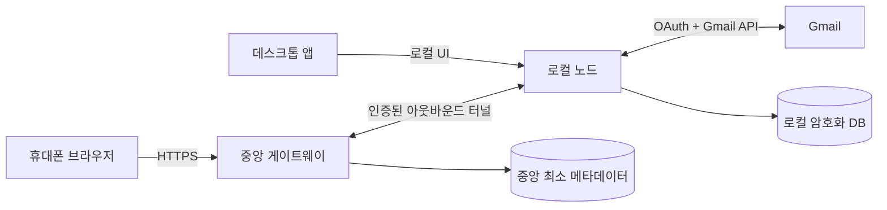

# Payflow Cursor 프로토타입 설계 가이드

## 1. 목표와 MVP 경계

Payflow는 정기결제·구독 정보를 사용자의 PC에 보관하고, 사용자가 휴대폰 브라우저에서 안전하게 확인·관리하는 대시보드다.

MVP는 다음을 제공한다.

- Google 로그인으로 사용자와 기기를 식별한다.
- 사용자의 PC에서 실행되는 로컬 노드가 구독·결제 상태를 보관한다.
- 휴대폰과 데스크톱 UI가 중앙 게이트웨이를 통해 인증된 로컬 노드에 연결된다.
- 데모 데이터로 요약, 검색, 상태 변경, 다음 결제일을 표시한다.
- Gmail 연결은 별도 화면에서 최소 범위 권한을 요청하고, 메일 근거 기반 구독 후보를 보여준다.

MVP에서 제외한다.

- 직접 카드 결제와 카드정보 입력·보관
- 임의의 공개 포트포워딩
- 중앙 서비스의 메일 본문·구독 상세 보관
- 다중 사용자 간 결제·구독 데이터 공유

## 2. 선택한 아키텍처



### 2.1 사용자 PC: 로컬 노드

- `127.0.0.1:8000`에만 바인딩한다. 게이트웨이를 제외한 외부 인바운드 연결은 허용하지 않는다.
- 구독, 결제 상태, 메일 근거, 사용자 메모를 로컬 DB에 저장한다.
- OAuth 비밀값과 암호화 키는 OS 키체인에 보관한다.
- 게이트웨이로부터의 요청도 사용자·기기·세션을 다시 검증한다.
- 네트워크 연결이 끊겨도 데스크톱 로컬 UI와 저장 데이터는 계속 사용할 수 있어야 한다.

### 2.2 중앙 게이트웨이

- 고정된 우리 도메인에서 HTTPS, Google OIDC 로그인, 세션 관리, 기기 라우팅을 제공한다.
- PC가 밖으로 먼저 여는 mTLS 또는 동등한 인증된 터널만 수락한다.
- 중앙 DB에는 사용자 ID, 기기 공개키, 연결 상태, 터널 라우팅 ID, 보안 감사 메타데이터만 저장한다.
- 릴레이는 필요한 요청·응답만 전달하며, 구독 상세나 Gmail 본문을 영구 저장하지 않는다.

### 2.3 클라이언트 UI

- 데스크톱은 로컬 노드의 UI를 우선 사용한다.
- 휴대폰은 중앙 게이트웨이의 HTTPS UI에서 로그인한 뒤 자신의 로컬 노드로 릴레이된다.
- UI는 사용 중인 데이터 원본(데모, 로컬, 동기화 시각)과 연결 상태를 항상 표시한다.

## 3. 프로토타입 저장소 구조

초기 구현은 TypeScript 모노레포로 시작한다. 특정 런타임·프레임워크 버전은 첫 스캐폴딩 작업에서 잠금 파일과 함께 확정한다.

```text
apps/
  web/                 # React 기반 대시보드 UI
  local-node/          # PC 상주 API·DB·Gmail 커넥터
  gateway/             # HTTPS 인증·세션·터널 릴레이
packages/
  contracts/           # 공유 API 타입·스키마·에러 코드
  security/            # 토큰 마스킹·감사 이벤트·권한 도우미
  test-fixtures/       # 익명화된 데모 데이터만
docs/
  cursor-prototype-guide.md
```

## 4. 핵심 데이터와 경계

| 모델 | 저장 위치 | 필수 필드 | 금지 필드 |
| --- | --- | --- | --- |
| Subscription | 로컬 DB | id, 서비스명, 금액, 통화, 주기, 다음 결제일, 상태 | 전체 카드번호, CVC |
| MailEvidence | 로컬 DB | Gmail 메시지 참조, 추출 시각, 후보 값, 신뢰도, 검토 상태 | 불필요한 전체 본문 복제 |
| Device | 중앙 DB | userId, deviceId, 공개키, 상태, 최근 연결 | 로컬 DB 내용, Gmail 토큰 |
| AuditEvent | 중앙·로컬 | 이벤트 종류, 시간, 결과, 최소 식별자 | 토큰, 이메일 본문, 결제수단 원문 |

공유 계약은 `packages/contracts`에 둔다. UI와 게이트웨이가 로컬 DB 테이블을 직접 알면 안 된다.

## 5. 사용자 흐름

### 온보딩

1. 사용자가 데스크톱 앱을 설치하고 로컬 노드를 시작한다.
2. 앱이 기기 키를 만들고 게이트웨이에 등록한다.
3. 사용자가 Google 로그인으로 계정을 확인한다.
4. 휴대폰에서 로그인하면 등록된 PC를 선택하고 기기 페어링을 승인한다.

### 대시보드

1. UI는 선택한 로컬 노드에서 구독 요약과 목록을 읽는다.
2. 사용자는 검색·상태 필터·메모·상태 변경을 수행한다.
3. 변경은 로컬 노드의 검증된 API로 저장되고, UI는 결과 상태를 명확히 갱신한다.

### Gmail 연결

1. 사용자가 ‘Gmail 연결’을 명시적으로 선택한다.
2. 필요한 최소 범위의 권한과 목적을 보여준다.
3. 로컬 노드가 메일 후보를 추출하고 사용자가 추가·수정·제외한다.
4. 계정 연결 해제와 로컬 데이터 삭제를 제공한다.

## 6. 프로토타입 단계와 수용 기준

### 단계 A — 로컬 대시보드

- 데모 데이터로 카드·목록·검색·상태 필터·결제 예정 요약을 구현한다.
- 수용 기준: 네트워크 호출 없이 데스크톱과 좁은 화면에서 동작하며, 테스트가 요약·필터·상태 변경을 검증한다.

### 단계 B — 로컬 노드와 저장소

- 로컬 API, 마이그레이션, 암호화 키 추상화, 데모 DB를 구현한다.
- 수용 기준: 서버는 loopback만 수신하고, DB 스키마·API 계약·권한 오류가 테스트된다.

### 단계 C — 게이트웨이와 기기 페어링

- 테스트용 Google 로그인 대체 인증부터 구현하고, 기기 등록·세션·터널 계약을 만든다.
- 수용 기준: 다른 사용자의 기기 ID로 요청하면 거부되고, 로컬 노드에 직접 공개 포트가 없다.

### 단계 D — Gmail 후보 추출

- OAuth 연결 해제, 최소 권한, 익명화된 메일 픽스처, 후보 검토 화면을 구현한다.
- 수용 기준: 토큰과 원본 본문은 로그에 없고, 잘못된 후보를 사용자가 수정·제외할 수 있다.

실제 Google OAuth와 외부 터널은 단계 C·D의 계약과 보안 검토가 끝난 뒤에만 연결한다. 직접 결제는 이 프로토타입의 후속 별도 프로젝트다.

## 7. Cursor 서브에이전트 구성

| 에이전트 | 담당 범위 | 입력 | 산출물 | 절대 넘지 않을 경계 |
| --- | --- | --- | --- | --- |
| Orchestrator | 작업 분해·통합 | 이 문서, 이슈 | 순서화된 작업·계약 변경 기록 | 개별 기능 대량 구현 |
| Dashboard UI | `apps/web` | API 계약·디자인 | 접근 가능한 화면·UI 테스트 | DB·OAuth·터널 구현 |
| Local Node | `apps/local-node` | API 계약 | loopback API·로컬 DB·동기화 어댑터 | 공개 라우팅·중앙 세션 |
| Gateway/Auth | `apps/gateway` | Device 계약 | 로그인·세션·기기 라우팅 | 로컬 구독 데이터 저장 |
| Security/Test | 전 경계 읽기 전용 검토 | 변경 diff·테스트 | 위협 모델·보안 테스트·결함 보고 | 제품 동작 임의 변경 |
| Release | 통합 | 통과한 변경 | CI·릴리스 체크리스트 | 기능 사양 변경 |

병렬 작업은 공유 계약이 먼저 확정된 뒤에만 한다. `packages/contracts` 변경은 Orchestrator와 Security/Test 검토를 동시에 거친다.

서브에이전트 정의는 `.cursor/agents/`에 둔다. 메인 에이전트는 경계를 넘는 작업을 해당 파일로 위임한다.

## 8. Cursor 스킬 명세

Cursor의 스킬은 짧고, 한 번에 한 워크플로만 강제한다. 아래 스킬은 `.cursor/skills/<name>/SKILL.md`에 둔다.

| 스킬 | 트리거 | 반드시 수행할 절차 |
| --- | --- | --- |
| `plan-and-coordinate` | 기능을 여러 앱이 함께 수정 | 의존성 그래프 작성 → 계약 선확정 → 병렬 작업 배정 → 통합 순서 기록 |
| `payment-dashboard-ui` | 대시보드 화면·상호작용 구현 | 상태·빈 화면·오류·로딩 상태 정의 → 접근성 확인 → UI 테스트 |
| `local-node-security` | 로컬 API·DB·키 관리 변경 | loopback 바인딩 확인 → 입력 검증 → 키체인 사용 → 민감 로그 탐지 테스트 |
| `gateway-auth` | 로그인·세션·기기 라우팅 변경 | 소유권 확인 → 세션 만료·재인증 → 사용자/기기 권한 테스트 |
| `gmail-ingestion` | Gmail OAuth·메일 추출 작업 | 최소 범위 확인 → 익명 픽스처 우선 → 근거·신뢰도 기록 → 해제·삭제 흐름 테스트 |
| `privacy-and-secrets` | 데이터 모델·로그·분석 변경 | 데이터 분류 → 최소 저장 검토 → 비밀정보 스캔 → 보존 위치 명시 |
| `security-review` | 인증·터널·외부 노출 변경 | 위협 모델 → 권한 우회 테스트 → 재현 가능한 위험 보고 |
| `test-evidence` | 작업 완료 주장 전 | 단위·계약·통합 테스트 실행 → 결과와 미검증 영역 보고 |
| `integration-release` | 통합·배포 준비 | 마이그레이션 검토 → 롤백 조건 → 릴리스 체크리스트 → 변경 요약 |

스킬 본문은 반복 가능한 절차와 프로젝트 고유의 금지사항만 담고, 일반 프로그래밍 설명은 넣지 않는다. 상세 스키마와 예시는 `references/`에 분리한다.

## 9. 작업 요청 템플릿

오케스트레이터는 서브에이전트에게 다음 형식으로만 작업을 전달한다.

```text
목표: [검증 가능한 한 문장]
담당 경계: [수정 가능한 폴더]
입력 계약: [타입/API/문서 경로]
수용 기준: [테스트 가능한 조건 2~4개]
금지사항: [민감 데이터, 타 경계, 실제 외부 호출]
검증 명령: [정확한 명령 또는 아직 없는 이유]
```

## 10. 공통 완료 게이트

모든 작업은 다음을 충족해야 완료다.

1. 변경 범위가 담당 경계 안에 있다.
2. 테스트, 타입 검사, 린트 중 적용 가능한 검증을 실행했고 결과가 기록됐다.
3. 실제 Gmail·결제·외부 터널 호출은 명시적으로 승인된 단계에서만 발생한다.
4. 비밀정보·개인정보가 코드, 로그, 픽스처, 오류 메시지에 포함되지 않는다.
5. 공개 API·스키마 변경은 계약 패키지와 소비자 테스트를 함께 갱신한다.
